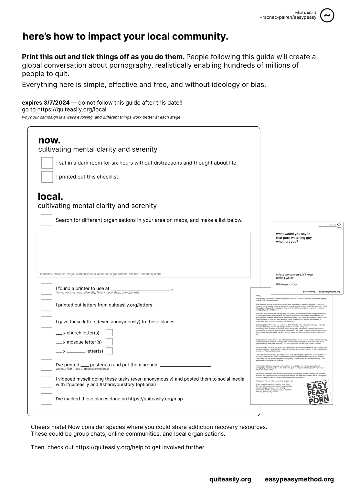

# Chương 33: Bây giờ

Chúc mừng bạn đã đến được cuối quyển sách. Quả thật là điều đáng quý khi chúng ta có thể cùng nhau đi đến chặng này của hành trình.

Lời đầu tiên, xin chúc mừng bạn đã thành công trên hành trình dừng xem porn. Bạn sẽ nhận thấy cuộc sống trở nên tươi đẹp hơn biết bao khi không còn porn, và việc đoạn tuyệt với porn sẽ mở ra cho bạn vô vàn điều kỳ diệu.

Bạn là một phần thiết yếu của thế gian này, và ngay bây giờ, giây phút này đây, là thời điểm duy nhất thực sự tồn tại. Tự cổ chí kim, bao giáo lý tâm linh đều quy về một điều: mọi khổ đau đều bắt nguồn từ việc không chấp nhận hiện tại và luôn thèm khát một cái gì khác.

Dĩ nhiên, có lý tưởng, có mục đích là điều tốt đẹp. Nhưng nếu bạn để cho giá trị của bản thân lệ thuộc vào một điều gì ở bên ngoài, hay để cho quá khứ và tương lai tưởng tượng chi phối, thì bạn đã vô tình lạc mất chính mình.

Hãy sống trọn vẹn trong bây giờ, tỉnh táo và hiện diện – bởi chỉ nơi đây mới là thực tại.

Ví dụ, và cũng là một bài thực hành trong suốt quá trình đoạn tuyệt với porn, bạn sẽ sớm trải nghiệm một khoảnh khắc giác ngộ (hay thấu hiểu) khác. Khi một cơn thèm porn chợt ùa đến, bạn nhận ra rằng: ồ, đó chỉ là một tư tưởng – mà nguyên nhân là chính porn đã gieo rắc trong ta trước kia. Khi ấy, bạn sẽ thấy một cảm giác nhẹ nhõm và hân hoan – vì bạn đã tách biệt được mình khỏi ý nghĩ ấy.

Bạn có thể ứng dụng điều này với mọi suy nghĩ, dù tích cực hay tiêu cực, dù là mắc kẹt trong quá khứ hay mộng mơ về tương lai, và từ đó sống trọn vẹn hơn, không bị tâm trí dẫn dắt vào những nỗi bất an không tên.

Ngay cả khi bạn đang ngồi trên một bãi biển tuyệt đẹp, sóng vỗ êm đềm, nhạc êm ru, hoàng hôn buông xuống – bạn vẫn có thể rơi vào tuyệt vọng, nếu để cho tư tưởng tiêu cực dẫn dắt.

Ngay lúc này, khi bạn đang đọc những dòng này, bạn có thể dừng lại một chút để cảm nhận thân thể bạn đang ngồi, không gian quanh bạn, âm thanh vang lên – và biết rằng: đây là tất cả những gì đang có. Không gì bên ngoài có thể thêm được vào sự thanh thản vốn dĩ đã có trong bạn. Bạn không bị định nghĩa bởi porn, hay bất kỳ điều gì khác – trừ khi chính bạn tự nghĩ như thế.

Nhận thức là bài học trọng yếu nhất mà tôi có thể trao gửi đến bạn. EasyPeasy chỉ đơn thuần là khơi gợi nhận thức của bạn về porn, và hỏi bạn rằng bạn có thực sự hoan nghênh nó trong cuộc đời mình không. Vậy nên, chính nhận thức thuần khiết sẽ trao cho bạn câu trả lời cho mọi vấn đề mà bạn đang đối diện.

Tôi biết, điều này nghe có vẻ "mơ hồ", nhưng quả thật, mọi vấn đề tôi từng nghe từ mọi người (kể cả với phương pháp Easypeasy) đều xoay quanh một điều: không nhận ra rằng họ đang suy nghĩ. Họ để cho những chuyện nhỏ nhặt hay to lớn làm khổ bản thân, hoặc như với Rasypeasy, họ vật lộn với hàng loạt lý do mà tâm trí bày ra để quay lại với porn – mà những lý do ấy nghe qua tưởng chừng rất hợp lý – thay vì hiểu rằng bạn hoàn toàn có thể buông bỏ chúng một cách nhẹ nhàng. Nhưng thật ra, mọi vấn đề đều là thất bại trong việc chú tâm và chấp nhận giây phút hiện tại. Bạn có thể không thích nó – nhưng chấp nhận trọn vẹn hiện tại là con đường duy nhất để tiến về phía trước.

Tôi đang viết lại cuốn sách này để truyền tải cho bạn sự hiểu ấy. Easypeasy từ trước đến nay chủ yếu là kể ra các lý do vì sao bạn không thật sự thích porn, thay vì trò chuyện và để bạn tự ngộ ra. Tôi đang nỗ lực cho sự chuyển đổi đó, và mong một ngày có thể đối thoại cùng bạn sâu hơn. Trong thời gian này, tôi buộc phải đưa phần này vào (dù văn phong còn đôi chỗ gượng gạo).

Về chuyện “MO” (Thủ dâm & Cực khoái), xin bạn hãy thành tâm chấp nhận năng lượng tính dục tự nhiên của thân thể, và chuyển hoá nó, lưu thông khắp toàn thân.

## Vậy thì, tiếp theo sẽ là gì đây?

Bạn không nhất thiết phải thay đổi cuộc sống chỉ vì đoạn tuyệt với porn. Ví dụ, bạn có thể hình dung cảnh ai đó cố tình giấu nhẹm máy tính đi vì sợ cám dỗ porn – nhưng bạn sẽ sớm nhận ra rằng việc rũ bỏ thứ vốn chỉ kìm hãm bạn, và đón nhận hạnh phúc, bình yên, sự tập trung, và sự tự do khỏi cảnh nô lệ, sẽ giúp bạn kiến tạo một cuộc sống tốt đẹp hơn, đáng mơ ước.

Bạn cũng có thể tìm hiểu thêm về những gì chúng tôi đang thực hiện tại [https://peacefulfoundation.org](https://peacefulfoundation.org), vốn dĩ là thắp lửa lại cho cộng đồng địa phương.

## Lan tỏa phương pháp EasyPeasy

Một trong những yếu tố giúp cộng đồng trở nên tốt đẹp hơn chính là sự giải thoát khỏi nghiện ngập. Nếu bạn mong muốn chung tay lan tỏa phương pháp EasyPeasy, có hai việc bạn có thể thực hiện:

### Lan truyền meme Coomer

Tôi có hàng ngàn meme Coomer trên [https://coomer.org](https://coomer.org) và rất mong bạn sẽ rộng tay chia sẻ chúng ở bất cứ đâu bạn thấy phù hợp.

Nếu bạn là một người ưa thích sự phá cách, hãy tham khảo triết lý của Coomer tại [https://coomer.org/ethos](https://coomer.org/ethos), và nghiền ngẫm về sự phức tạp của thế giới, về bản ngã ngày càng lớn mạnh trong cơn nghiện màn hình. Nếu không, có lẽ bạn sẽ bị coi là "hai lúa" đấy.

Dù sao thì, đó cũng là meme mà tôi yêu thích nhất, và hy vọng bạn cũng sẽ đồng điệu với điều đó.

### Khơi gợi những cuộc đối thoại

Những người tuân theo danh sách này, một cách thiết thực, sẽ khơi dậy một cuộc đối thoại toàn cầu về porn và những chứng nghiện được bình thường hóa khác, giúp hàng trăm triệu người thành công trên hành trình đoạn tuyệt với porn.

Bạn cũng có thể khơi gợi những cuộc đối thoại trên mạng. Hãy dành thời gian nghiền ngẫm về tất cả những người đang chịu ảnh hưởng trực tiếp và gián tiếp bởi porn, và cách bạn có thể tiếp cận và giúp đỡ họ. Và hãy khắc ghi rằng tác động tại địa phương là hữu hiệu nhất, và chứng kiến được tác động thực tế là điều ý nghĩa nhất.

Bạn cũng có thể truy cập [https://quiteasily.org/help](https://quiteasily.org/help) để tìm hiểu thêm về một chiến dịch đối thoại khác, các đường dẫn quyên góp cho [https://peacefulfoundation.org](https://peacefulfoundation.org), và những phương cách khác để bạn có thể góp phần thay đổi thế giới.

Thực ra, tất cả chỉ là việc suy xét xem những người đang chịu ảnh hưởng bởi porn đang ở đâu (chính là tất cả mọi người), và làm thế nào để vươn tay đến và giúp đỡ họ.

## Ảo mộng

Porn chính là sự triệt tiêu ảo mộng. Nơi bạn bị dẫn dụ một cách máy móc đến cực khoái thông qua những ám ảnh có điều kiện, vốn ngày càng leo thang theo mức độ chai sạn của bạn. Quá trình cai nghiện sẽ khơi gợi vô vàn câu hỏi về xu hướng tính dục của bạn, nhưng hãy thấu hiểu rằng những ám ảnh có điều kiện này không phải là bản chất của bạn, và chưa bao giờ là bản chất của bạn cả. Dù là một người mê phim khiêu dâm bạo lực và một người nghiện thường xem softcore ảnh tĩnh thì họ cũng chẳng khác nhau là mấy. Hãy nghỉ ngơi, bồi dưỡng sự thuần khiết và tình yêu thương. Rồi những câu hỏi này sẽ tự được giải đáp theo thời gian.

Để được hỗ trợ thêm, bạn có thể truy cập [https://semenretention.org](https://semenretention.org).

Việc xoá bỏ ảo tưởng còn có tác động sâu sắc đến xã hội. Khi bạn không còn khả năng mơ mộng, bạn bị trói buộc vào những giấc mơ có sẵn của hệ thống hiện hành. Bạn không còn tự mơ giấc mơ của mình nữa, mà chỉ nhìn giấc mơ của người khác, để rồi bào chữa cho sự thờ ơ với chính cuộc sống của mình.