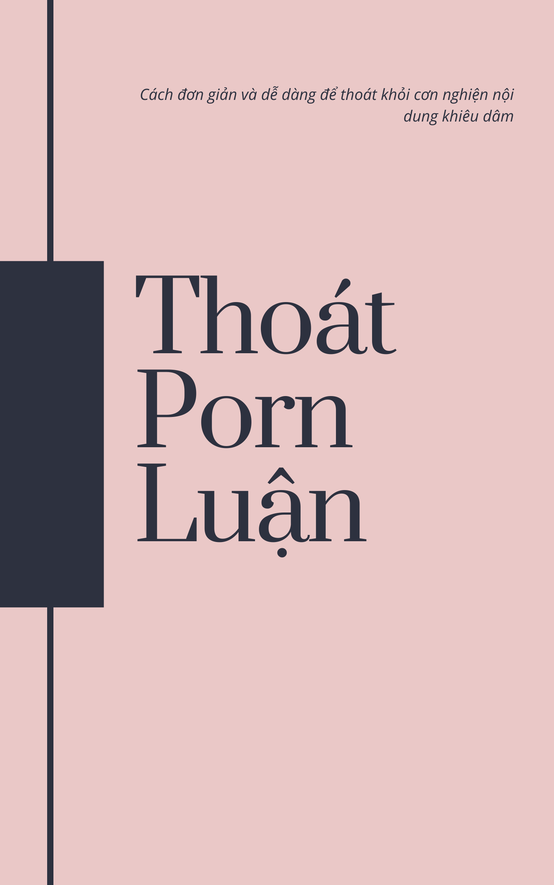

# Thoát porn luận

Bản dịch Tiếng Việt cho sách [EasyPeasy](https://read.easypeasymethod.org/). Mọi góp ý về bản dịch xin vui lòng gửi vào [mục Issue của dự án này trên Github](https://github.com/duy103zxc/easypeasymethod-vi/issues), hoặc [gửi Email cho mình](mailto:duykhanh471@protonmail.com).

### Không theo nguyên tác

Bản dịch này đã được rút gọn một số phần mà cá nhân mình thấy không thực sự cần thiết trong quá trình đọc. Đồng thời, mình cũng đã viết lại khá nhiều ví dụ cộng với một số cách ví von.

Cá nhân mình gợi ý đọc bản gốc Tiếng Anh nếu bạn có khả năng Tiếng Anh tốt. Bản Tiếng Anh cũng tuân theo đúng cấu trúc cuốn sách của Allen Carr nữa.

### Các định dạng khác
Bạn có thể tải sách về để đọc trên máy đọc sách:

- [EPUB](thoat-porn-luan.epub)
- [MOBI](thoat-porn-luan.mobi)

### Thông tin thêm

Một số "thuật ngữ" cho bản dịch đây (Bạn không cần đọc hết cũng được, nếu trong bản dịch có từ được giữ nguyên Tiếng Anh thì ghé qua đây thôi):

- **PMO (Porn, Masturbation, Orgasm):** PMO (Porn, Thủ dâm, Cực khoái)
- **PMOer:** Người "thực hành" PMO.
- **Porn:** Porn, porn trên mạng, Nội dung khiêu dâm
- **Triệu chứng cai nghiện:** Dịch theo đúng tên gốc là "withdrawal symptoms". Trong ngữ cảnh của tác phẩm nó nên được hiểu đúng hơn là "Triệu chứng dừng xem porn" vì việc "dừng xem porn" ở đây khác với việc cai nghiện (Theo cách hiểu của mình, bạn nên đọc thêm tác phẩm để tìm hiểu thêm).
- **Porn "diet":** Chế độ "kiêng" porn (Kiểu vài ngày xem porn một lần)
- **Fantasy:** Mộng tưởng, Ảo mộng
- **Guru:** Guru (giữ nguyên gốc, hiểu là chuyên gia, người có kiến thức uyên bác)
- **Jerk (jerk off):** Kẻ đần độn (nhưng "jerk off": thủ dâm, mang tính xúc phạm)
- **Non-user:** Người không xem (Ở đây ám chỉ những người không xem porn)
- **online harem**: Các trang web lưu porn tốc độ cao và chất lượng cao (Chất lượng thấp cũng tính luôn).
- **PE (Premature Ejaculation):** Xuất tinh sớm
- **PIED (Porn-Induced Erectile Dysfunction):** Rối loạn cương dương do porn gây ra
- **Dopamine withdrawal:** Sự rút lui dopamine, là hiện tượng xảy ra khi não bộ giảm sản xuất hoặc giảm phản ứng với dopamine, một chất dẫn truyền thần kinh liên quan đến cảm giác khoái lạc và động lực).
- **Porn session:** Lần xem porn
- **Propagative (sex):** (Tình dục) về mặt sinh sản
- **Search-and-seek dopamine:** Dopamine "tìm kiếm-và-theo đuổi"
- **Semen retention:** Giữ tinh dịch
- **Sexual dysfunction:** Rối loạn chức năng tình dục
- **Static porn:** Porn tĩnh (ảnh tĩnh)
- **Tantric (sex):** (Tình dục) tantric
- **Edging:** Cố tình kéo dài khoái cảm trước khi lên đỉnh.

### Credit
Dưới đây là phần trích từ chương đầu của cuốn sách:

Tại sao lại là Hackbook? Allen Carr đã qua đời từ lâu và tổ chức của ông không hề hỗ trợ điều trị cho hội chứng nghiện porn. 

Trong suốt cuốn sách này, bản thân tôi, Hackauthor và Allen Carr sẽ ở đây để cung cấp cho bạn một phương pháp độc đáo và hấp dẫn để loại bỏ cơn nghiện một cách dễ dàng và không đau đớn.

**Hackbook:** Một cuốn sách được dựa trên một cuốn sách khác. Tác giả gốc được ghi nguồn đầy đủ. 

Chúc may mắn, nhưng bạn sẽ sớm tìm được cho mình thứ bạn cần trong cuốn sách này thôi.

Good vibes,

Hackauthor²

Cuốn sách này được phát hành dưới giấy phép [Creative Commons Attribution-ShareAlike 4.0 International License](https://creativecommons.org/licenses/by-sa/4.0/). Phần code được phát hành dưới giấy phép [GPLv3](https://gitlab.com/snuggy/easypeasy/-/blob/master/LICENSE).

**Lưu ý:** 

- Nội dung bản dịch Tiếng Việt gốc từ Chương 1 đến Chương 10 được lấy từ bản dịch Tiếng Việt của camus và sửa lại.
- Từ Chương 10 đến Chương 33 được tạo bản dịch nháp bởi Gemini.